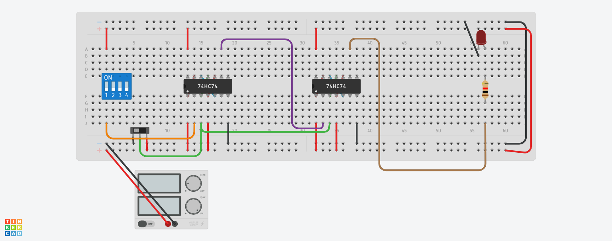
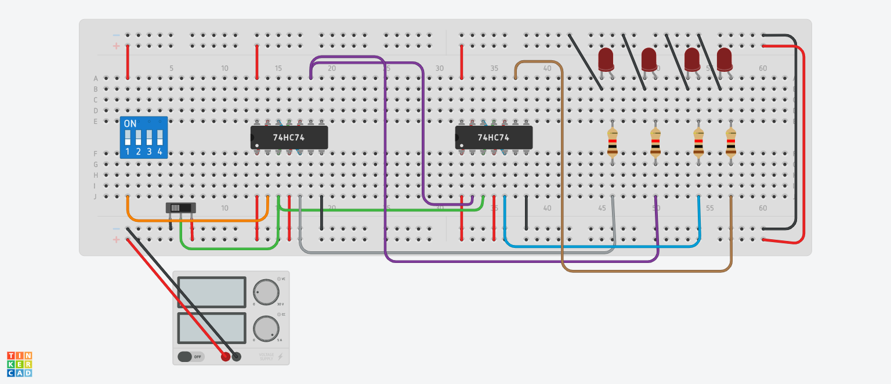
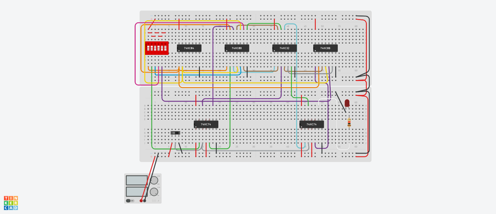
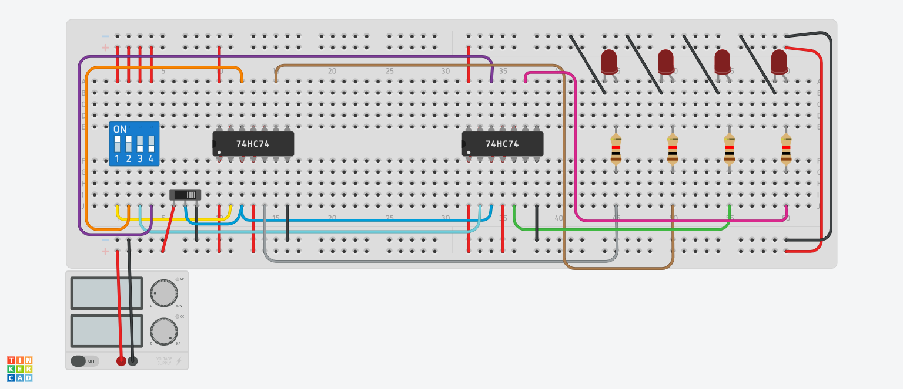

# Shift Registers
A shift register is a digital memory circuit found in calculators, computers, and data-processing systems. Bits (binary digits) enter the shift register at one end and emerge from the other end. The two ends are called left and right. Flip flops, also known as bistable gates, store and process the data.

Basically, these registers are classified into four types and working of shift registers are discussed below. Serial in Serial out (SISO) Shift Register. Serial in parallel out (SIPO) Shift Register. Parallel in Serial out (PISO) Shift Register. Parallel in Parallel out (PIPO) Shift Register.

## Serial in Serial out (SISO)

Serial In Serial Out (SISO) shift registers are a kind of shift registers where both data loading as well as data retrieval to/from the shift register occurs in serial-mode.

The shift register, which allows serial input (one bit after the other through a single data line) and produces a serial output is known as Serial-In Serial-Out shift register. Since there is only one output, the data leaves the shift register one bit at a time in a serial pattern, thus the name Serial-In Serial-Out Shift Register.
[SISOTinkerCAD](https://www.tinkercad.com/things/aNAr09fvSdX-siso/editel)

## Serial in parallel out (SIPO)

The shift register, which allows serial input (one bit after the other through a single data line) and produces a parallel output is known as Serial-In Parallel-Out shift register.

The circuit consists of four D flip-flops which are connected. The clear (CLR) signal is connected in addition to the clock signal to all the 4 flip flops in order to RESET them. The output of the first flip flop is connected to the input of the next flip flop and so on. All these flip-flops are synchronous with each other since the same clock signal is applied to each flip flop.

[SIPOTinkerCAD](https://www.tinkercad.com/things/lQxxdGlhBTc-sipo/editel)

## Parallel in Serial out (PISO)

The shift register, which allows parallel input (data is given separately to each flip flop and in a simultaneous manner) and produces a serial output is known as Parallel-In Serial-Out shift register.

 The circuit consists of four D flip-flops which are connected. The clock input is directly connected to all the flip flops but the input data is connected individually to each flip flop through a multiplexer at the input of every flip flop. The output of the previous flip flop and parallel data input are connected to the input of the MUX and the output of MUX is connected to the next flip flop. All these flip-flops are synchronous with each other since the same clock signal is applied to each flip flop.
 
 
 [PISOTinkerCAD](https://www.tinkercad.com/things/9i0URF2D91q-piso/editel)

 ## Parallel in Parallel out (PIPO)

The shift register, which allows parallel input (data is given separately to each flip flop and in a simultaneous manner) and also produces a parallel output is known as Parallel-In parallel-Out shift register.

 The circuit consists of four D flip-flops which are connected. The clear (CLR) signal and clock signals are connected to all the 4 flip flops. In this type of register, there are no interconnections between the individual flip-flops since no serial shifting of the data is required. Data is given as input separately for each flip flop and in the same way, output also collected individually from each flip flop.
 
 
 [PIPOTinkerCAD](https://www.tinkercad.com/things/9yHI3uGJR1H-pipo/editel)